# 🚢 Port of Entry Threat Hunt


<div align="center">


</div>

</div>

<div align="center">


<table>
<tr>
<td align="center">

<h3>🛡️ Cyber Range Scenario Credit 🛡️</h3>

<strong>This threat hunt scenario was provided by Josh Madakor, CEO of The Cyber Range.</strong>

<br><br>

<a href="https://www.skool.com/cyber-range">
  
</a>

</td>
</tr>
</table>

</div>

## 📌 Overview

This threat hunt investigated a suspected compromise at **Azuki Import/Export Trading Co.** after sensitive supplier contracts and pricing data appeared on underground forums. The investigation focused on the compromised system **AZUKI-SL** using Microsoft Defender for Endpoint telemetry.

The hunt followed an incident response workflow to determine the initial access method, compromised account, attacker activity, defense evasion, credential access, persistence, command-and-control, data staging, exfiltration, and lateral movement activity.

---

## 🧪 Lab / Investigation Details

| Category | Details |
|---|---|
| Incident Name | Port of Entry |
| Company | Azuki Import/Export Trading Co. |
| Compromised Host | `azuki-sl` |
| Primary Account Compromised | `kenji.sato` |
| Data Source | Microsoft Defender for Endpoint Logs |
| Main Tables Used | `DeviceLogonEvents`, `DeviceProcessEvents`, `DeviceFileEvents`, `DeviceRegistryEvents`, `DeviceNetworkEvents` |
| Investigation Window | `2025-11-19` to `2025-11-20` |

---

## 🎯 Investigation Objectives

- Identify the initial access source.
- Determine the compromised account.
- Investigate suspicious process execution.
- Identify discovery, staging, credential access, persistence, and defense evasion activity.
- Determine what data was staged and how it was exfiltrated.
- Identify command-and-control infrastructure.
- Determine whether lateral movement occurred.
- Document findings with screenshots, KQL, and a clear investigation timeline.

---

# 🔎 Investigation Walkthrough

## 1. Reviewing Logon Events for Initial Access

I started by reviewing authentication activity on the compromised workstation `azuki-sl`. The goal was to identify successful and failed logons, determine whether external access occurred, and identify the account used by the attacker.

```kql
let TargetDevice = "azuki-sl";
DeviceLogonEvents
| where DeviceName == TargetDevice
| where Timestamp between (datetime(2025-11-19) .. datetime(2025-11-20))
| where LogonType has_any ("RemoteInteractive", "Interactive", "Network")
| project Timestamp, DeviceName, AccountName, AccountDomain, ActionType, LogonType, RemoteIP, RemoteIPType, FailureReason
| order by Timestamp asc
```

**Finding:** A successful public network logon was observed from `88.97.178.12`, followed by successful activity under the account `kenji.sato`.

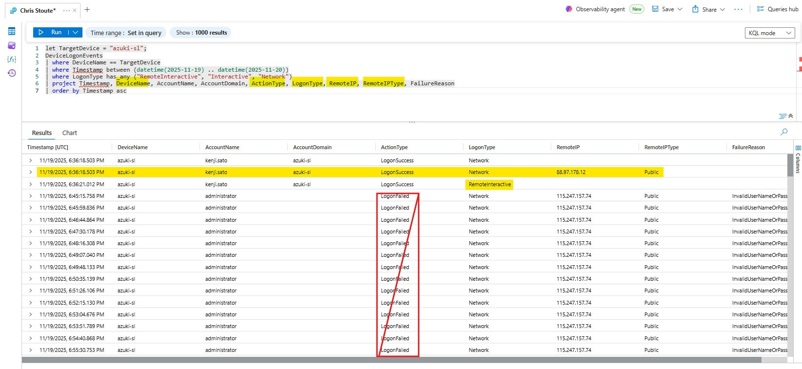

**Flag 1:** `88.97.178.12`  
**Flag 2:** `kenji.sato`

---

## 2. Investigating Kenji Sato Process Execution

After identifying `kenji.sato` as the compromised account, I pivoted into process execution telemetry to determine what commands and programs were run after the suspicious logon.

```kql
let TargetDevice = "azuki-sl";
DeviceProcessEvents
| where DeviceName == TargetDevice
| where Timestamp between (datetime(2025-11-19) .. datetime(2025-11-20))
| where AccountName == "kenji.sato"
| project Timestamp, DeviceName, AccountName, ActionType, FileName, ProcessCommandLine, InitiatingProcessFileName, InitiatingProcessCommandLine
| order by Timestamp asc
```

**Finding:** The account executed suspicious PowerShell, command prompt, script, and Windows utility activity after the initial access event.

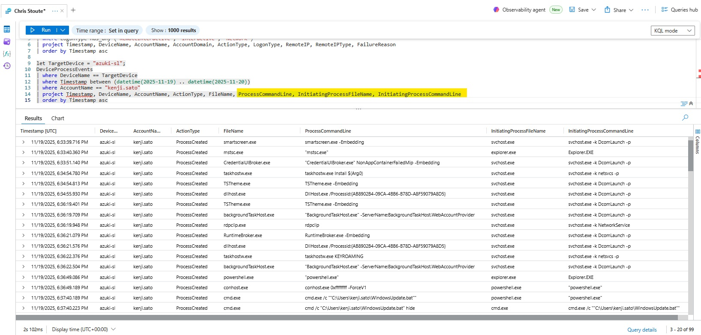

---

## 3. Identifying Network Neighbor Enumeration

The next pivot focused on discovery commands that could reveal local network neighbors, interfaces, routes, and nearby hosts.

```kql
let TargetDevice = "azuki-sl";
DeviceProcessEvents
| where DeviceName == TargetDevice
| where Timestamp between (datetime(2025-11-19) .. datetime(2025-11-20))
| where AccountName == "kenji.sato"
| where FileName in~ ("cmd.exe", "powershell.exe", "arp.exe", "net.exe", "nbtstat.exe", "ipconfig.exe", "route.exe")
    or ProcessCommandLine has_any ("arp", "net view", "nbtstat", "ipconfig", "route print", "Get-NetNeighbor", "neighbor", "mac", "interface")
| project Timestamp, DeviceName, AccountName, ActionType, FileName, ProcessCommandLine, InitiatingProcessFileName, InitiatingProcessCommandLine
| order by Timestamp asc
```

**Finding:** The attacker ran ARP enumeration to identify network neighbors.


**Flag 3:** `ARP.EXE -a`

---

## 4. Identifying the Malware Staging Directory

I pivoted to file telemetry to determine where malware and supporting files were staged on disk. This was important because file creation events often provide cleaner evidence of where the attacker dropped tools, payloads, or archives.

```kql
let TargetDevice = "azuki-sl";
DeviceFileEvents
| where DeviceName == TargetDevice
| where Timestamp between (datetime(2025-11-19) .. datetime(2025-11-20))
| where RequestAccountName == "kenji.sato"
| where FolderPath has_any ("ProgramData", "AppData", "Temp", "WindowsUpdate", "wupdate")
    or FileName has_any ("WindowsUpdate.bat", "wupdate", ".bat", ".ps1", ".zip", ".7z", ".rar")
| project Timestamp, DeviceName, RequestAccountName, ActionType, FileName, FolderPath, InitiatingProcessFileName, InitiatingProcessCommandLine
| order by Timestamp asc
```

**Finding:** Multiple suspicious files were created in `C:\ProgramData\WindowsCache`, including renamed binaries and the staged archive.

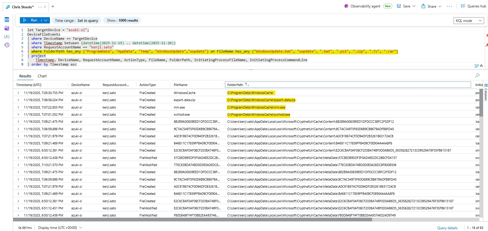

**Flag 4:** `C:\ProgramData\WindowsCache`

---

## 5. Identifying Windows Defender Extension Exclusions

Next, I reviewed registry telemetry for Microsoft Defender exclusions. Attackers commonly exclude file extensions from scanning so that malicious scripts, executables, or batch files are not detected.

```kql
let TargetDevice = "azuki-sl";
DeviceRegistryEvents
| where DeviceName == TargetDevice
| where Timestamp between (datetime(2025-11-19) .. datetime(2025-11-20))
| where RegistryValueName != ""
| where RegistryKey contains @"Windows Defender\Exclusions\Extensions"
| project Timestamp, DeviceName, ActionType, RegistryKey, RegistryValueName, RegistryValueData, InitiatingProcessAccountName, InitiatingProcessFileName, InitiatingProcessCommandLine
| order by Timestamp asc
```

**Finding:** Three Defender extension exclusions were created for `.bat`, `.ps1`, and `.exe`.

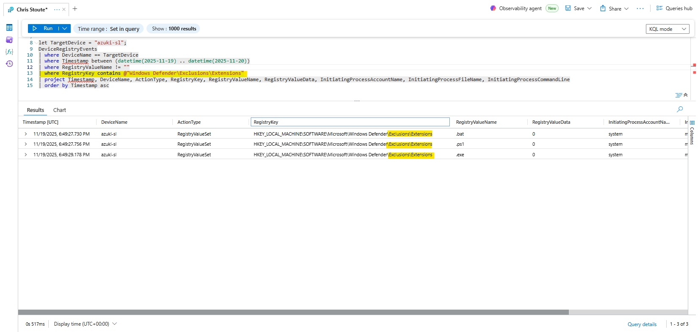

**Flag 5:** `3 Instances`

---

## 6. Identifying Windows Defender Path Exclusions

After identifying extension exclusions, I checked Defender path exclusions to determine whether the attacker excluded a staging or temp directory.

```kql
let TargetDevice = "azuki-sl";
DeviceRegistryEvents
| where DeviceName == TargetDevice
| where Timestamp between (datetime(2025-11-19) .. datetime(2025-11-20))
| where RegistryValueName != ""
| where RegistryKey contains @"Windows Defender\Exclusions\Paths"
| project Timestamp, DeviceName, ActionType, RegistryKey, RegistryValueName, RegistryValueData, InitiatingProcessAccountName, InitiatingProcessFileName, InitiatingProcessCommandLine
| order by Timestamp asc
```

**Finding:** A temporary user path was excluded from Defender scanning.

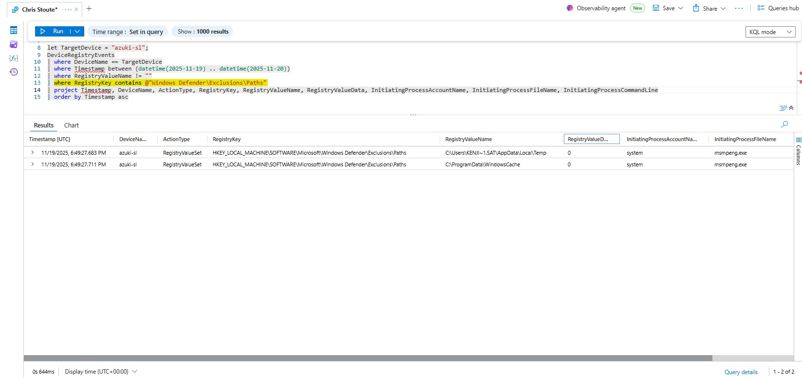

**Flag 6:** `C:\Users\KENJI~1.SAT\AppData\Local\Temp`

---

## 7. Identifying the Windows Native Download Binary

I then searched for common Windows-native download utilities and command-line download patterns.

```kql
let TargetDevice = "azuki-sl";
DeviceProcessEvents
| where DeviceName == TargetDevice
| where Timestamp between (datetime(2025-11-19) .. datetime(2025-11-20))
| where AccountName == "kenji.sato"
| where ProcessCommandLine has_any ("http", "https", "download", "urlcache", "Invoke-WebRequest", "iwr", "curl", "bitsadmin", "certutil", "OutFile", "-f")
| project Timestamp, DeviceName, AccountName, ActionType, FileName, ProcessCommandLine, InitiatingProcessFileName, InitiatingProcessCommandLine
| order by Timestamp asc
```

**Finding:** `certutil.exe` was used to download attacker tooling into the staging directory.

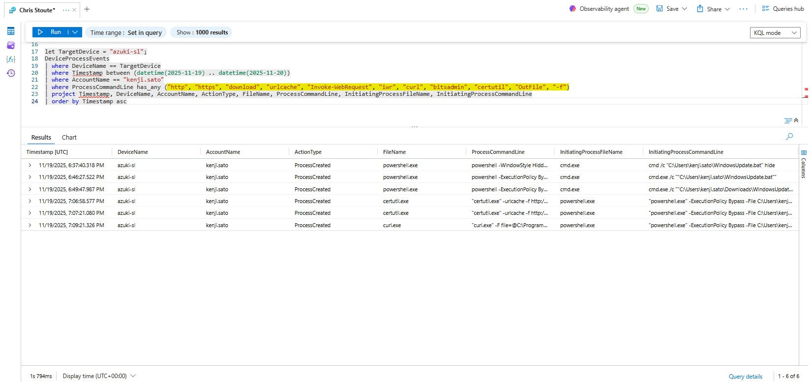

**Flag7 :** `certutil.exe`

---

## 8. Identifying Scheduled Task Persistence

To identify persistence, I searched for scheduled task creation using `schtasks.exe` and command-line task creation arguments.

```kql
let TargetDevice = "azuki-sl";
DeviceProcessEvents
| where DeviceName == TargetDevice
| where Timestamp between (datetime(2025-11-19) .. datetime(2025-11-20))
| where AccountName == "kenji.sato"
| where FileName in~ ("schtasks.exe", "cmd.exe", "powershell.exe")
    or ProcessCommandLine has_any ("schtasks", "/create", "/tn", "/sc", "/tr", "WindowsUpdate", "wupdate")
| project Timestamp, DeviceName, AccountName, ActionType, FileName, ProcessCommandLine, InitiatingProcessFileName, InitiatingProcessCommandLine
| order by Timestamp asc
```

**Finding:** A scheduled task was created to run a suspicious executable from the malware staging directory.

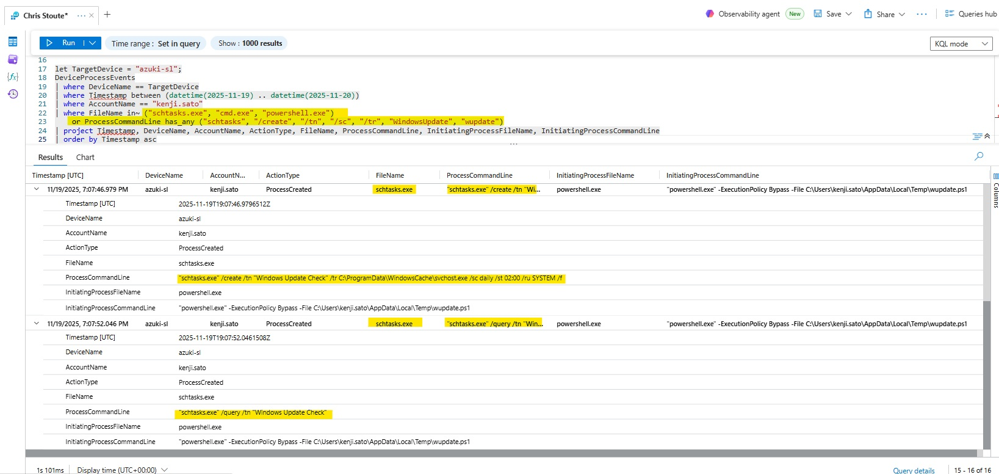

**Flag8 :** `Windows Update Check`

---

## 9. Identifying the Scheduled Task Target Executable

I reviewed the full `schtasks.exe /create` command to identify the executable configured in the `/tr` argument.

**Finding:** The scheduled task target executable was `C:\ProgramData\WindowsCache\svchost.exe`.

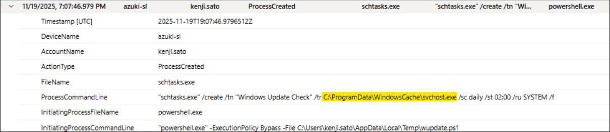

**Flag9 :** `C:\ProgramData\WindowsCache\svchost.exe`

---

## 10. Identifying Command-and-Control Server Address

Since the scheduled task launched `svchost.exe` from the staging directory, I pivoted into network events where that suspicious binary made outbound connections.

```kql
let TargetDevice = "azuki-sl";
DeviceNetworkEvents
| where DeviceName == TargetDevice
| where Timestamp between (datetime(2025-11-19) .. datetime(2025-11-20))
| where InitiatingProcessFileName =~ "svchost.exe"
| where InitiatingProcessFolderPath has @"C:\ProgramData\WindowsCache"
| project Timestamp, DeviceName, InitiatingProcessAccountName, InitiatingProcessFileName, InitiatingProcessFolderPath, RemoteIP, RemotePort, RemoteUrl, ActionType
| order by Timestamp asc
```

**Finding:** The suspicious `svchost.exe` process connected to an external C2 server over HTTPS.

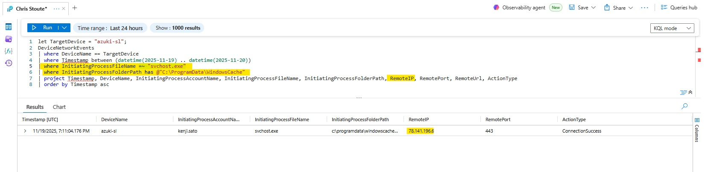

**Flag10 :** `78.141.196.6`

---

## 11. Identifying the C2 Communication Port

Using the same network telemetry, I confirmed the remote port used by the suspicious C2 connection.

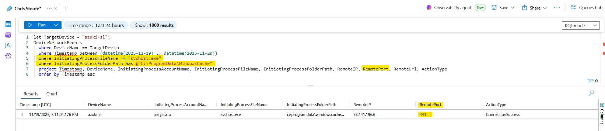

**Flag 11:** `Port 443`

---

## 12. Identifying the Credential Dumping Tool

Next, I searched for credential dumping indicators, including suspicious process names and command-line arguments commonly associated with credential theft.

```kql
let TargetDevice = "azuki-sl";
DeviceProcessEvents
| where DeviceName == TargetDevice
| where Timestamp between (datetime(2025-11-19) .. datetime(2025-11-20))
| where FileName has_any ("mm.exe", "svchost.exe", "powershell.exe", "cmd.exe")
    or ProcessCommandLine has_any ("lsass", "sekurlsa", "logonpasswords", "privilege::debug", "mm.exe")
| project Timestamp, DeviceName, AccountName, ActionType, FileName, ProcessCommandLine, InitiatingProcessFileName, InitiatingProcessCommandLine
| order by Timestamp asc
```

**Finding:** `mm.exe` executed credential dumping commands associated with Mimikatz-style behavior.

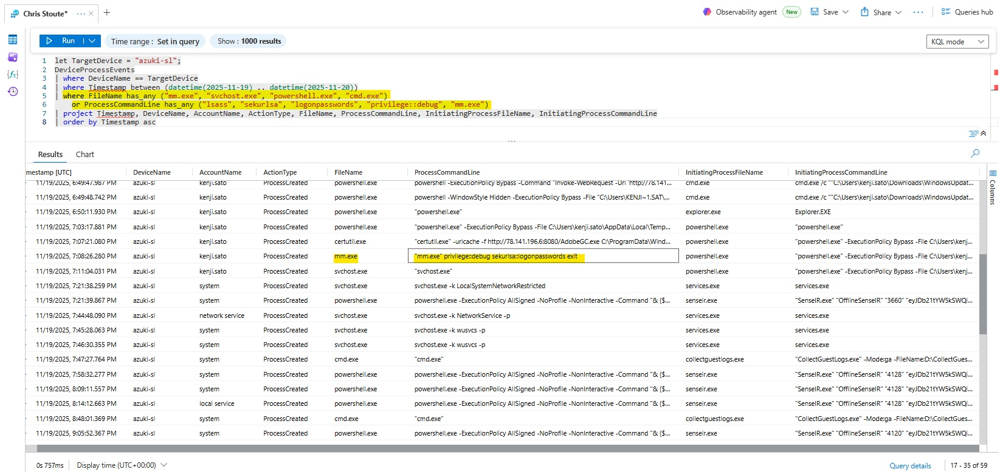

**Flag 12:** `mm.exe`  
**Flag 13:** `sekurlsa::logonpasswords`

---

## 13. Identifying Staged Data Archive

I searched file events in the malware staging directory for archive files created by the attacker.

```kql
let TargetDevice = "azuki-sl";
DeviceFileEvents
| where DeviceName == TargetDevice
| where Timestamp between (datetime(2025-11-19) .. datetime(2025-11-20))
| where FolderPath has @"C:\ProgramData\WindowsCache"
    or FileName endswith ".zip"
    or FileName endswith ".7z"
    or FileName endswith ".rar"
| project Timestamp, DeviceName, RequestAccountName, ActionType, FileName, FolderPath, InitiatingProcessFileName, InitiatingProcessCommandLine
| order by Timestamp asc
```

**Finding:** The attacker staged collected data as `export-data.zip`.

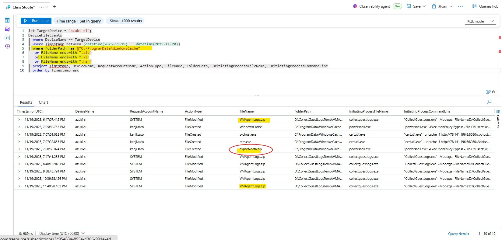

**Flag 14:** `export-data.zip`

---

## 14. Identifying Data Exfiltration to Discord

I reviewed network telemetry for outbound file transfer activity related to the staged archive.

```kql
let TargetDevice = "azuki-sl";
DeviceNetworkEvents
| where DeviceName == TargetDevice
| where Timestamp between (datetime(2025-11-19) .. datetime(2025-11-20))
| where InitiatingProcessCommandLine has_any ("export-data.zip", "upload", "curl", "Invoke-WebRequest", "iwr", "https", "POST")
    or RemoteUrl has_any ("dropbox", "drive", "onedrive", "mega", "box", "transfer", "file", "upload")
| project Timestamp, DeviceName, InitiatingProcessAccountName, InitiatingProcessFileName, InitiatingProcessCommandLine, RemoteIP, RemotePort, RemoteUrl, ActionType
| order by Timestamp asc
```

**Finding:** The archive was exfiltrated to Discord over HTTPS.

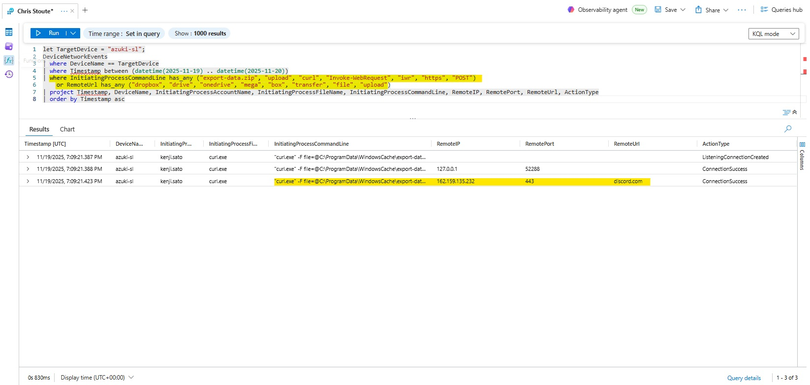

**Flag 15:** `Discord`

---

## 15. Identifying Event Log Clearing Activity

To investigate anti-forensics, I searched for commands that cleared Windows event logs.

```kql
let TargetDevice = "azuki-sl";
DeviceProcessEvents
| where DeviceName == TargetDevice
| where Timestamp between (datetime(2025-11-19) .. datetime(2025-11-20))
| where FileName == "wevtutil.exe"
    or ProcessCommandLine has_any ("wevtutil", "cl", "clear-log", "Clear-EventLog")
| project Timestamp, DeviceName, AccountName, ActionType, FileName, ProcessCommandLine, InitiatingProcessFileName, InitiatingProcessCommandLine
| order by Timestamp asc
```

**Finding:** The attacker cleared the Security event log.

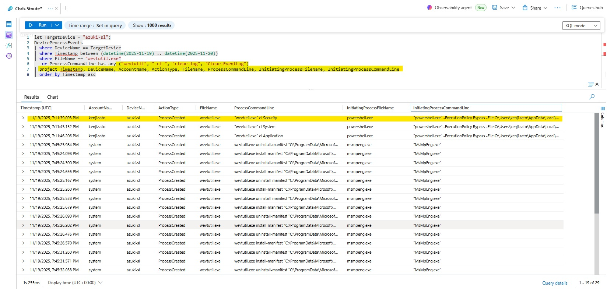

**Flag 16:** `Security Log Tampering`

---

## 16. Identifying Local Administrator Account Creation

I searched for commands that created or modified local users and local administrator group membership.

```kql
let TargetDevice = "azuki-sl";
DeviceProcessEvents
| where DeviceName == TargetDevice
| where Timestamp between (datetime(2025-11-19) .. datetime(2025-11-20))
| where ProcessCommandLine has_any ("net user", "net.exe user", "/add", "localgroup", "administrators", "admin", "useradd")
| project Timestamp, DeviceName, AccountName, ActionType, FileName, ProcessCommandLine, InitiatingProcessFileName, InitiatingProcessCommandLine
| order by Timestamp asc
```

**Finding:** The attacker created the `support` account and added it to the local Administrators group.

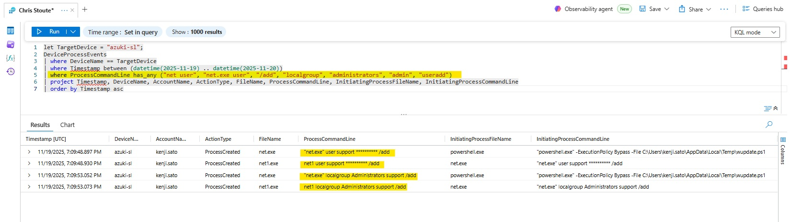

**Flag 17:** `Support Account Creation`

---

## 17. Identifying the Malicious PowerShell Attack Script

I pivoted back into file telemetry to identify malicious scripts created by the attacker.

```kql
let TargetDevice = "azuki-sl";
DeviceFileEvents
| where DeviceName == TargetDevice
| where Timestamp between (datetime(2025-11-19) .. datetime(2025-11-20))
| where RequestAccountName == "kenji.sato"
| where FileName endswith ".ps1"
    or FileName endswith ".bat"
| project Timestamp, DeviceName, RequestAccountName, ActionType, FileName, FolderPath, InitiatingProcessFileName, InitiatingProcessCommandLine
| order by Timestamp asc
```

**Finding:** The malicious PowerShell attack script was `wupdate.ps1`.

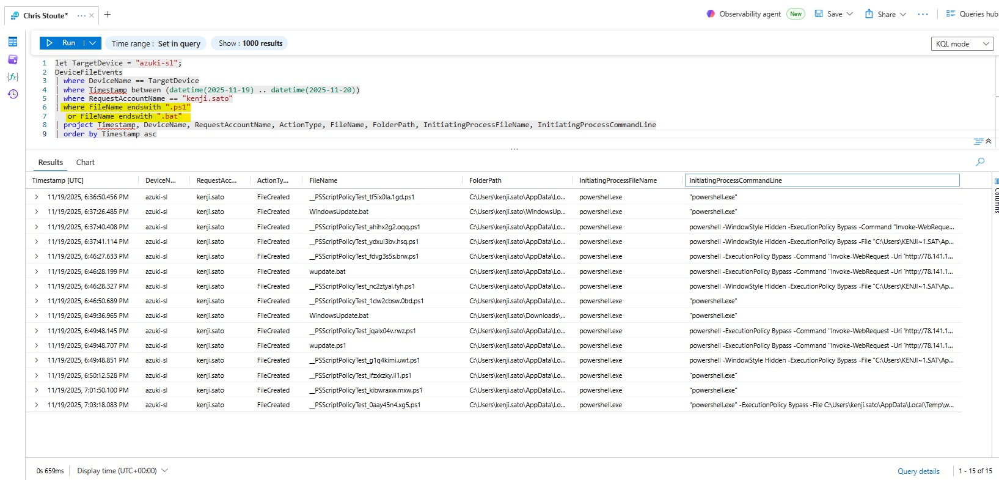

**Flag 18:** `wupdate.ps1`

---

## 18. Identifying RDP Credential Staging for Lateral Movement

I searched for RDP and credential staging activity using `cmdkey.exe` and `mstsc.exe`.

```kql
let TargetDevice = "azuki-sl";
DeviceProcessEvents
| where DeviceName == TargetDevice
| where Timestamp between (datetime(2025-11-19) .. datetime(2025-11-20))
| where ProcessCommandLine has_any ("cmdkey", "mstsc", "/generic", "/user", "/pass", "rdp", "Remote Desktop")
| project Timestamp, DeviceName, AccountName, ActionType, FileName, ProcessCommandLine, InitiatingProcessFileName, InitiatingProcessCommandLine
| order by Timestamp asc
```

**Finding:** The attacker staged RDP credentials for `10.1.0.188` using `cmdkey.exe`.

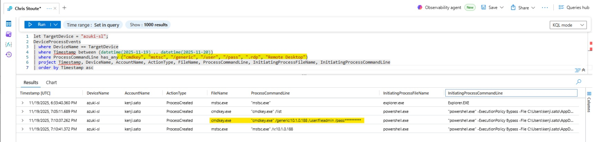

**Flag 19:** `10.1.0.188`

---

## 19. Identifying the Remote Access Tool Used for Lateral Movement

Using the same process telemetry, I confirmed the tool used to initiate the remote desktop session.

**Finding:** The attacker launched `mstsc.exe` to connect to `10.1.0.188`.

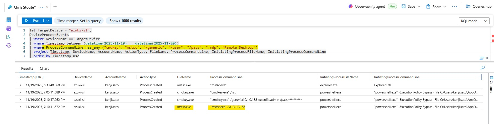

**Flag 20:** `mstsc.exe`

---

# 🧾 Flag  Summary

| Flag | Question / Finding |  |
|---:|---|---|
| 1 | Initial public source IP | `88.97.178.12` |
| 2 | Compromised account | `kenji.sato` |
| 3 | Network neighbor enumeration command and argument | `ARP.EXE -a` |
| 4 | Malware staging directory | `C:\ProgramData\WindowsCache` |
| 5 | Number of Defender extension exclusions | `3` |
| 6 | Defender temporary path exclusion | `C:\Users\KENJI~1.SAT\AppData\Local\Temp` |
| 7 | Windows-native download binary | `certutil.exe` |
| 8 | Scheduled task name | `Windows Update Check` |
| 9 | Scheduled task target executable | `C:\ProgramData\WindowsCache\svchost.exe` |
| 10 | C2 server address | `78.141.196.6` |
| 11 | C2 communication port | `443` |
| 12 | Credential dumping tool | `mm.exe` |
| 13 | Credential dumping command | `sekurlsa::logonpasswords` |
| 14 | Staged data archive | `export-data.zip` |
| 15 | Exfiltration destination/service | `Discord` |
| 16 | Cleared event log | `Security` |
| 17 | Local admin account created | `support` |
| 18 | Malicious PowerShell script | `wupdate.ps1` |
| 19 | Lateral movement target IP | `10.1.0.188` |
| 20 | Remote access tool | `mstsc.exe` |

---

# 🚨 Incident Response Summary

## Summary of Findings

- The attacker gained access to `azuki-sl` using the compromised account `kenji.sato` from public IP `88.97.178.12`.
- The attacker executed PowerShell, batch files, and built-in Windows utilities to download payloads, stage malware, evade Defender, and maintain persistence.
- Malware and supporting files were staged in `C:\ProgramData\WindowsCache`.
- Microsoft Defender exclusions were created for `.bat`, `.ps1`, `.exe`, and the user temp directory.
- A scheduled task named `Windows Update Check` was created to run `C:\ProgramData\WindowsCache\svchost.exe` for persistence.
- The staged malware communicated with C2 server `78.141.196.6` over port `443`.
- Credentials were dumped using `mm.exe` with `sekurlsa::logonpasswords`.
- Data was archived as `export-data.zip` and exfiltrated to Discord.
- The attacker cleared the Security event log, created a local administrator account named `support`, and attempted lateral movement to `10.1.0.188` using `mstsc.exe`.

---

## Who, What, When, Where, Why, and How

### Who

**Compromised Account:** `kenji.sato`  
**Compromised Host:** `azuki-sl`  
**Attacker Source IP:** `88.97.178.12`  
**C2 Server:** `78.141.196.6:443`

### What

The attacker used valid credentials to access the workstation, executed malicious scripts, staged malware, created Defender exclusions, established scheduled task persistence, dumped credentials, archived business data, exfiltrated the archive to Discord, cleared logs, created a local admin account, and initiated lateral movement.

### When

The primary attack activity occurred on **November 19, 2025**, within the investigation window of `2025-11-19` through `2025-11-20`.

### Where

**Primary Host:** `azuki-sl`  
**Malware Staging Directory:** `C:\ProgramData\WindowsCache`  
**Temp Exclusion Path:** `C:\Users\KENJI~1.SAT\AppData\Local\Temp`  
**Lateral Movement Target:** `10.1.0.188`

### Why

The likely attacker objective was theft of supplier contracts and pricing data, matching the business impact described in the incident brief.

### How

The attacker used valid account access, Windows-native utilities, PowerShell, Defender exclusion changes, scheduled task persistence, credential dumping, archive staging, Discord-based exfiltration, event log clearing, local admin account creation, and RDP lateral movement.

---

# 🧠 MITRE ATT&CK Mapping

| Tactic | Technique | Evidence |
|---|---|---|
| Initial Access | Valid Accounts / External Remote Services | Successful logon from `88.97.178.12` as `kenji.sato` |
| Execution | Command and Scripting Interpreter | PowerShell, CMD, batch, and PS1 execution |
| Persistence | Scheduled Task/Job | `Windows Update Check` scheduled task |
| Persistence | Create Account | Local admin account `support` created |
| Defense Evasion | Impair Defenses | Defender exclusions for extensions and paths |
| Defense Evasion | Indicator Removal | `wevtutil.exe cl Security` activity |
| Discovery | System Network Configuration Discovery | `ARP.EXE -a` |
| Credential Access | OS Credential Dumping | `mm.exe` with `sekurlsa::logonpasswords` |
| Collection | Archive Collected Data | `export-data.zip` |
| Command and Control | Application Layer Protocol | C2 over HTTPS to `78.141.196.6:443` |
| Exfiltration | Exfiltration Over Web Service | Upload to Discord |
| Lateral Movement | Remote Services | RDP via `mstsc.exe` to `10.1.0.188` |

---

# 🛡️ Recommended Remediation

## Immediate Actions

- Disable or reset the compromised `kenji.sato` account.
- Isolate `azuki-sl` from the network.
- Block `88.97.178.12` and `78.141.196.6` at firewall/proxy controls.
- Remove the scheduled task `Windows Update Check`.
- Remove the local administrator account `support`.
- Delete malicious files from `C:\ProgramData\WindowsCache` and the user temp directory.
- Remove malicious Microsoft Defender exclusions.
- Review Discord outbound traffic and block unauthorized file-sharing destinations.

## Short-Term Actions

- Rotate credentials for users who logged into `azuki-sl`.
- Review authentication logs for additional external access.
- Hunt across the environment for `wupdate.ps1`, `WindowsUpdate.bat`, `mm.exe`, `export-data.zip`, and `WindowsCache`.
- Audit local administrator group membership across endpoints.
- Review RDP usage and restrict external or unnecessary Remote Desktop access.

## Long-Term Actions

- Enforce MFA for all remote access.
- Implement conditional access and geo/IP-based access policies.
- Monitor for Defender exclusion changes.
- Alert on suspicious scheduled task creation.
- Alert on `certutil.exe`, `curl.exe`, `cmdkey.exe`, `mstsc.exe`, and `wevtutil.exe` abuse.
- Create detections for suspicious archive creation and uploads to file-sharing platforms.
- Improve least privilege controls and local admin account monitoring.

---

# 📚 Skills Demonstrated

- Microsoft Defender for Endpoint Advanced Hunting
- KQL investigation and query development
- Incident response documentation
- Authentication analysis
- Process execution analysis
- File event analysis
- Registry event analysis
- Network event analysis
- Threat hunting methodology
- MITRE ATT&CK mapping
- Persistence and defense evasion investigation
- Credential access investigation
- Data staging and exfiltration analysis
- Lateral movement investigation

---

<div align="center">

<a href="https://www.linkedin.com/in/chris-stoute-157040164/" target="_blank">
  
</a>

<br><br>


</div>
